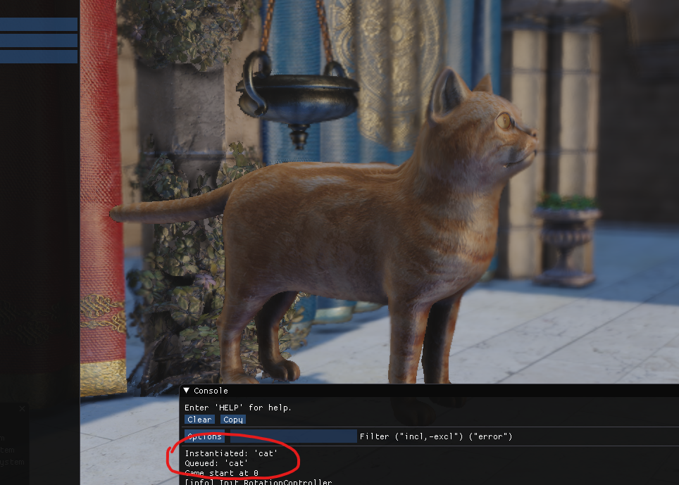

# [ML] Instantiate Objects After Prediction Through Input Image

Just a quick prototype to showcase object creation in-game after predicting type of object from an input image through inception-based image classification

## Requirements

- Docker 
- Python 3.8 or later
- Essentia Game Engine Running with RPC server at `127.0.0.1:8080`

## Steps

- Run AWS Deep Learning multi-model server docker image using following command

```
docker run -itd --name mms-inception-onnx -p 80:8080 -p 8081:8081 awsdeeplearningteam/multi-model-server multi-model-server --start --models onnx-inception-v1=https://s3.amazonaws.com/model-server/model_archive_1.0/onnx-inception_v1.mar
```

This will run the prediction server on localhost port 80 with Inception V1 ONNX model. 

- Run Essentia Game Engine and press play. This will start the RPC server and will listen for RPC commands
- Now run the trigger script with your input image, for example

```
python trigger.py kitten_small.jpg
```

- This will instantiate an object on-screen. If you ran the above command, it will instantiate an object with cat mesh.

